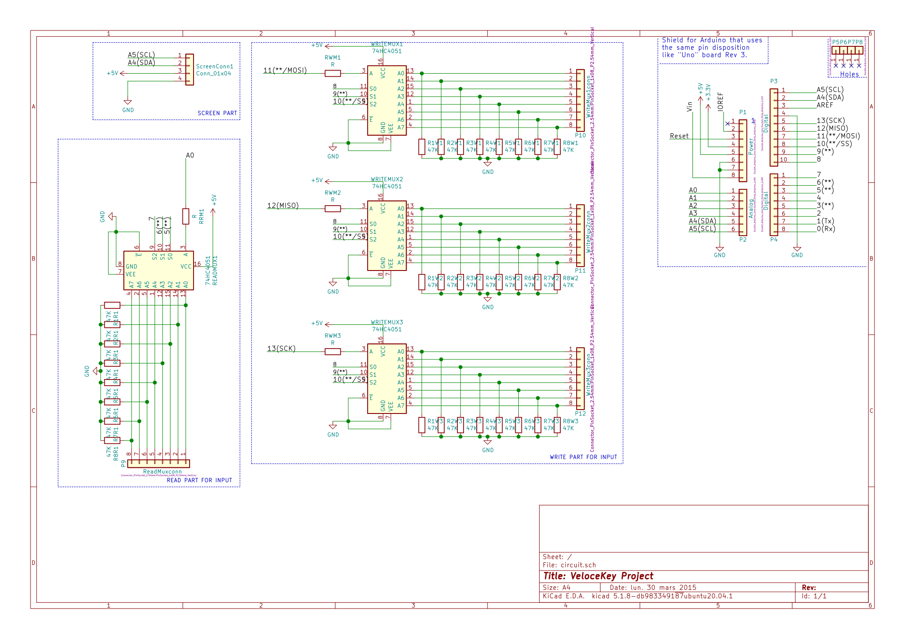

# 🎹 ARDUINO UNO BASED MIDI KEYBOARD WITH VELOCITY V0.1

The documentation of the code is currently being made as well as the code improved.

This project use the [Arduino MIDI Library](https://github.com/FortySevenEffects/arduino_midi_library)

:warning: the easiest way will always be to buy a midi-keyboard

Up to 88 Key(and more if needed) currently tested for 61 key without major issues.

This github repo is made to propose some (I hope) helpfull ressources to make a MIDI Keyboard wich take in charge the velocity using an arduino-uno and some multiplexer(74HC4051). This my first:

- ARDUINO based project.
- [ARDUINO library](https://github.com/Rathur421/MIDI-KEYBOARD/tree/Master/PCB/circuit) (and first C++ program).
- [PCB conception](https://github.com/Rathur421/MIDI-KEYBOARD/tree/Master/Arduino_Code/lib).

so please try to not be too rude.

The file for the arduino shield conception are [here](https://github.com/Rathur421/MIDI-KEYBOARD/tree/Master/PCB/circuit). The file were created using [Kicad](https://kicad.org/).

## How the electronics works

The number of pin on an arduino is clearly not sufficient to plug directly a keyboard matrice of a large keyboard so the idea is to use some multiplexer/demultiplexer to help us.

The biggest problem of this basic idea is that the more key you had the longueur will be the execution of the loop and the less precise will be the velocity.

we use only 1 demultiplexer `READMUX` and up to 3 multiplexer `WRITE_MUX`.
They are globally define in the code ([here](https://github.com/Rathur421/MIDI-KEYBOARD/blob/Master/Arduino_Code/lib/VeloceKey/src/VeloceKey.cpp) line 4 and 6) as they are dependent of the architecture of the project.

The switch between the different multiplexer is made by activating the pin to which each of the multiplexer is link in the PCB(from pin 11 to 13 of the arduino uno board) in the [main] program (from line 23 to 30).

## How the code works

You need to initialise all the key of your actual keyboard and put it in an array as in [main][main] from line 60 and 130.

Then you update all the key and check if the state changed based on the method `YOUR_VELOCEKEY.getKeyChanged()`.
If the state changed you can do the following:

- If it is in state 2 you can send a `MIDI.sendNoteOn(YOUR_VELOCEKEY.getNote(), YOUR_VELOCEKEY.getVelocity(), 1);`.
- If it is in state 3 you can send a `MIDI.sendNoteOff(YOUR_VELOCEKEY.getNote(), YOUR_VELOCEKEY.getVelocity(), 1);`.

That is made in the function update in [main][main] from line 20 to 58.

The code use principally the library [VeloceKey](###well-how-does-the-veloceKey-library-works)

### Well how does the VeloceKey library works?

This library is made to be intuitive for the user as each physical key of the keyboard correspond to a VeloceKey object in the program.

The VeloceKey object is built around a state byte to take the less place possible of the 2kB of RAM available on the Arduino Uno.

| bit position | 7        | 6        | 5                    | 4                    | 3              | 2                       | 1          | 0                   |
| ------------ | -------- | -------- | -------------------- | -------------------- | -------------- | ----------------------- | ---------- | ------------------- |
| used for     | not used | not used | Key previous state 1 | Key previous state 2 | velocity state | velocity previous state | main state | main previous state |

The key of a midi keyboard is composed of two push button, the main and velocity button each one have his `actual` and `previous state` stored inside the `state byte`.

When the programme loop the `state byte` [update](####Update) and if the `previous state` doesn't match with the `actual state` then the `key state` will be changed.

#### Key state

The `key state` can be accessed via the method `YOUR_VELOCEKEY.getKeyState()` which return a byte between 0 and 3 which stand for:

- 0: Key not pressed
- 1: Key currently pressed
- 2: Key pressed
- 3: Key released

The `key state` is not directly stored inside the `byte state` as it can be deduced of the `key previous state` and the `velocity` and `main state`

#### Update

The update basically store the `key previous state` and replace the `previous state` by the `actual state` before storing the `new state` in the `actual state` if necessary.

If the `state` just passed to 1 the time is registered inside the `veloceKey` object.

If the `state` just passed to 2 the timer is used to store the velocity inside the `veloceKey` object and can be accessed with `YOUR_VELOCEKEY.getVelocity()`.

[main]: https://github.com/Rathur421/MIDI-KEYBOARD/blob/Master/Arduino_Code/src/main.cpp
